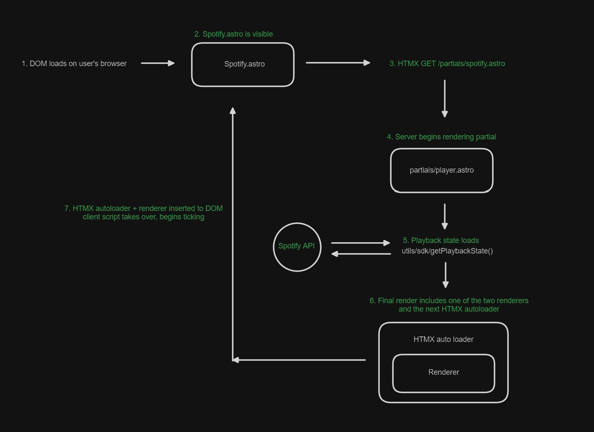

# spotify module

this is a set of components required to render spotify playback

## high level overview

- HTMX is used to enable automatic polling
- Redis is used to cache supporting data (tokens, mostly)
  - it can also cache api responses, but it's staying disabled until i get 429's
- Files and Folders:
  - `/api` all required api endpoints (re-export into `/src/pages/api/spfy`)
  - `/components` all internal astro components (don't render these manually)
  - `/partials` partials (re-render somewhere, i.e `/src/pages/partials/...`)
  - `/utils/shared.ts` shared between astro + the client
  - `/utils/hot.ts` code emulating live playback
  - `/utils/sdk.ts` code meant to fetch + render spotify data
  - `/utils/oauth.ts` code supporting oauth
  - `/Spotify.astro` the main component which you should render on the page
  - `/config.ts` contains constants/settings

in order to view my playback status, the spotify sdk requires an access token/refresh token oauth exchange:

- i visit `/api/spfy/auth`
- i get redirected to spotify
- i agree and get redirected to `/api/spfy/callback`
- i now have a valid auth token in my redis cache

once that's set up, it's good basically forever. then,

- a user loads my site, and `/Spotify.astro` renders somewhere on the page
- when visible and loaded, this component requests the partial via HTMX
- the partial is responsible for actually doing the hard work. it looks for cached data, and if found, returns it. if none is found or caching is disabled, it requests data from spotify and returns it.
- there is also a script, `/utils/hot.ts` which loads on first render & tries to emulate live playback. see the hot.ts section for more info

## the spotify player

the element `"#spfy-player"` will eventually exist with:

- `data-playing="boolean"`
- `data-duration="number"`
- `data-progress="number"`
- `data-nonce="randomStringFromServer"`
- a child for text `"#spfy-player-progress-text"`
- a child for a `style.width` as a percentage `"#spfy-player-progress-bar"`

an explanation for each value is below:

- `data-playing` updates when playback starts/stops representing play/pause state
- `data-nonce` updates with every new request and if it changes it corresponds to new canonical data that we must sync with.
- `data-duration` is a string (of a number) representing the length (in ms) of the song
- `data-progress` is a string (of a number) representing the progress (in ms) of playback

## hot.ts

this script loads on the client & attempts to imitate a live effect once the spotify element renders correctly
